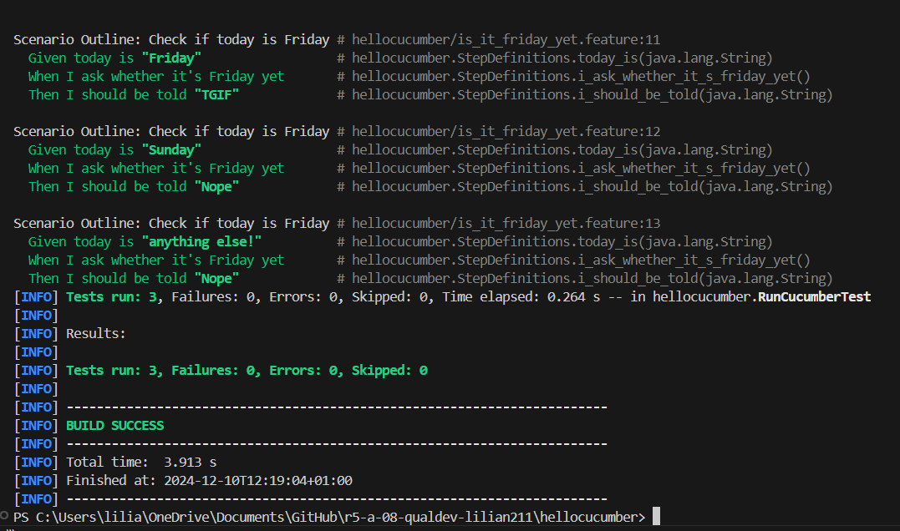
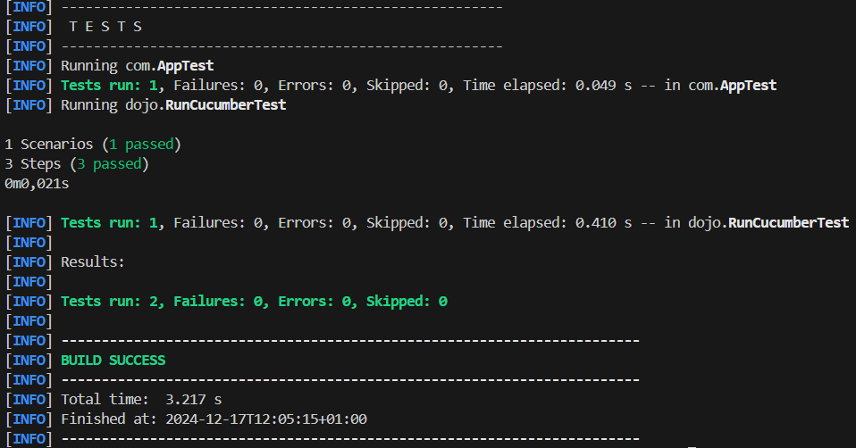

= R5.A.08 -- Dépôt pour les TPs
:icons: font
:MoSCoW: https://fr.wikipedia.org/wiki/M%C3%A9thode_MoSCoW[MoSCoW]

Ce dépôt concerne les rendus de mailto:lilian.monestier@etu.univ-tlse2.fr[Lilian Monestier].

== TP1

.Code is_it_friday_yet.feature
```
Feature: Is it Friday yet?
  Everybody wants to know when it's Friday

  Scenario Outline: Check if today is Friday
    Given today is "<day>"
    When I ask whether it's Friday yet
    Then I should be told "<answer>"

  Examples:
    | day            | answer |
    | Friday         | TGIF   |
    | Sunday         | Nope   |
    | anything else! | Nope   |
```

.Exécution des tests - success


== TP2

.Code Order.java
```
package dojo;

import java.util.ArrayList;
import java.util.List;

public class Order {
    private String owner;
    private String target;
    private List<String> cocktails;

    public Order() {
        this.cocktails = new ArrayList<>();
    }

    public void declareOwner(String owner) {
        this.owner = owner;
    }

    public void declareTarget(String target) {
        this.target = target;
    }

    public List<String> getCocktails() {
        return cocktails;
    }
}
```

.Exécution des tests - success

